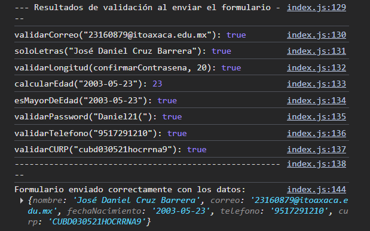
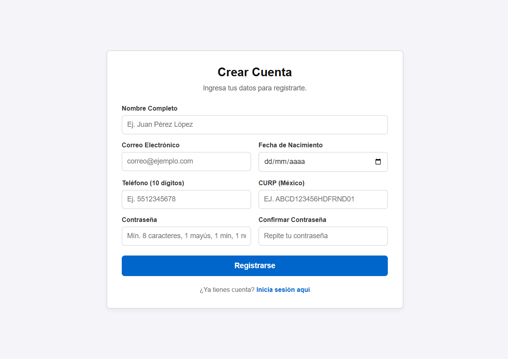
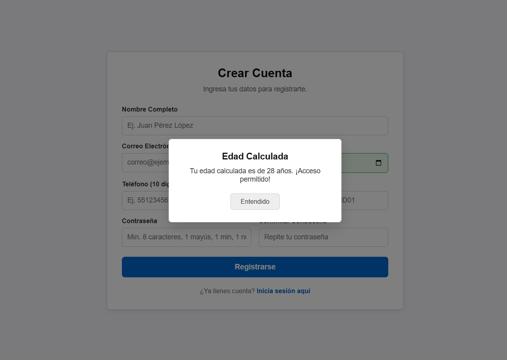
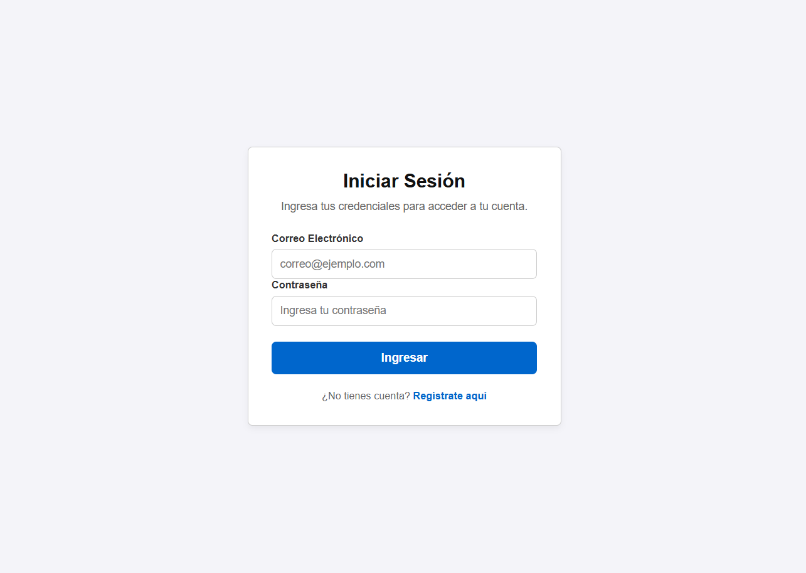

# Utilería JS - Librería de Validaciones

Una librería desarrollada en **JavaScript puro** que facilita la validación de datos en formularios web. Su propósito es reducir código repetitivo y proporcionar funciones reutilizables para validar información común como correos electrónicos, contraseñas, nombres, CURP, teléfonos y edad.

---

# Problema que resuelve

Al desarrollar formularios es común tener que escribir una y otra vez las mismas validaciones para verificar que los datos ingresados por el usuario sean correctos.

Esta librería concentra esas validaciones en un solo archivo (`utileria.js`), permitiendo reutilizarlas en cualquier proyecto web de forma sencilla y rápida.

---

# Estructura del proyecto

```
/utileria
│── README.md
│── index.html
│── login.html
│
├── css
│   └── styles.css
│
├── js
│   └── utileria.js
|   └── login.js
|   └── index.js
│
└── img
    
```

---

# Instalación

Descarga el archivo **utileria.js** y agrégalo antes de cerrar la etiqueta `body`.

```html
<script src="js/utileria.js"></script>
```

O si el archivo se encuentra en la misma carpeta:

```html
<script src="utileria.js"></script>
```

---

# 📖 Funciones de la librería

## 1. validarCorreo(correo)

Valida que un correo electrónico tenga un formato correcto.

**Parámetros**

| Parámetro | Tipo |
|-----------|------|
| correo | String |

**Retorna**

- `true` si el correo es válido.
- `false` si el formato es incorrecto.

### Codigo

```javascript
function validarCorreo(correo) {
    const expresionRegular = /^[a-zA-Z0-9._%+-]+@[a-zA-Z0-9.-]+\.[a-zA-Z]{2,}$/;
    return expresionRegular.test(correo);
}
```
---

## 2. soloLetras(texto)

Permite únicamente letras mayúsculas, minúsculas, espacios y vocales acentuadas.

**Parámetros**

| Parámetro | Tipo |
|-----------|------|
| texto | String |

**Retorna**

- `true` si el texto contiene únicamente letras.
- `false` si contiene números o símbolos.

### Codigo

```javascript
function soloLetras(texto) {
    const expresionRegular = /^[a-zA-ZáéíóúÁÉÍÓÚüÜñÑ\s]+$/;
    return expresionRegular.test(texto);
}
```

---

## 3. validarLongitud(numero, maxLongitud)

Valida que un número no exceda la longitud máxima permitida.

**Parámetros**

| Parámetro | Tipo |
|-----------|------|
| numero | Number o String |
| maxLongitud | Number |

**Retorna**

- `true` si la longitud es válida.
- `false` si supera el límite.

### Codigo

```javascript
function validarLongitud(numero, maxLongitud) {
    if (numero === null || numero === undefined) {
        return false;
    }
    const cadena = String(numero).trim();
    return cadena.length <= maxLongitud;
}
```


---

## 4. calcularEdad(fechaNacimiento)

Calcula la edad del usuario a partir de su fecha de nacimiento.

**Parámetros**

| Parámetro | Tipo |
|-----------|------|
| fechaNacimiento | Date (YYYY-MM-DD) |

**Retorna**

La edad como número entero.

### Codigo

```javascript
function calcularEdad(fechaNacimiento) {
    if (!fechaNacimiento) {
        return 0;
    }
    const hoy = new Date();
    const fechaCumple = new Date(fechaNacimiento);
    // Evitar desfase de zona horaria al crear el objeto Date
    const cumpleUTC = new Date(fechaCumple.getUTCFullYear(), fechaCumple.getUTCMonth(), fechaCumple.getUTCDate());
    let edadCalculada = hoy.getFullYear() - cumpleUTC.getFullYear();
    const diferenciaMeses = hoy.getMonth() - cumpleUTC.getMonth();
    if (diferenciaMeses < 0 || (diferenciaMeses === 0 && hoy.getDate() < cumpleUTC.getDate())) {
        edadCalculada--;
    }
    return edadCalculada;
}
```
---

## 5. esMayorDeEdad(fechaNacimiento)

Determina si una persona es mayor de edad.

**Parámetros**

| Parámetro | Tipo |
|-----------|------|
| fechaNacimiento | Date |

**Retorna**

- `true` si tiene 18 años o más.
- `false` en caso contrario.

### Codigo

```javascript
function esMayorDeEdad(fechaNacimiento) {
    const edad = calcularEdad(fechaNacimiento);
    return edad >= 18;
}
```
---

## 6. validarPassword(password)

Valida que una contraseña cumpla con los siguientes requisitos:

- Mínimo 8 caracteres
- Una letra mayúscula
- Una letra minúscula
- Un número
- Un carácter especial

**Parámetros**

| Parámetro | Tipo |
|-----------|------|
| password | String |

**Retorna**

- `true` si cumple todos los requisitos.
- `false` en caso contrario.

### Codigo

```javascript
function validarPassword(contrasena) {
    const expresionRegular = /^(?=.*[a-z])(?=.*[A-Z])(?=.*\d)(?=.*[@$!%*?&._\-#+=\[\]{}()^|~`:;,<>\/\\\"\'\`])[A-Za-z\d@$!%*?&._\-#+=\[\]{}()^|~`:;,<>\/\\\"\'\`]{8,}$/;
    return expresionRegular.test(contrasena);
}
```

---

# Funciones adicionales

## 7. validarCURP(curp)

Valida que una CURP mexicana tenga un formato correcto.

**Parámetros**

| Parámetro | Tipo |
|-----------|------|
| curp | String |

**Retorna**

- `true` si la CURP es válida.
- `false` si el formato es incorrecto.

### Codigo

```javascript
function validarCURP(curp) {
    if (!curp) {
        return false;
    }
    const expresionRegular = /^[A-Z]{4}\d{6}[HM][A-Z]{5}[A-Z\d]\d$/;
    return expresionRegular.test(curp.toUpperCase().trim());
}
```
---

## 8. validarTelefono(telefono)

Valida que un número telefónico mexicano tenga exactamente 10 dígitos.

Acepta espacios, guiones y paréntesis.

**Parámetros**

| Parámetro | Tipo |
|-----------|------|
| telefono | String |

**Retorna**

- `true` si el teléfono es válido.
- `false` si no cumple el formato.

### Codigo

```javascript
function validarTelefono(telefono) {
    if (!telefono) {
        return false;
    }
    const limpio = String(telefono).replace(/[\s\-()]/g, '');
    const expresionRegular = /^\d{10}$/;
    return expresionRegular.test(limpio);
}
```
---

# Integración del proyecto

La librería fue utilizada en tres componentes principales del proyecto.

## Formulario

El formulario utiliza las funciones:

- validarCorreo()
- soloLetras()
- validarLongitud()
- validarCURP()
- validarTelefono()
- esMayorDeEdad()

---

## Modal

Después de seleccionar la fecha de nacimiento se calcula automáticamente la edad utilizando:

```javascript
const edad = calcularEdad(fechaNacimiento);
```

La edad se muestra dentro de una ventana modal.

---

## Login

El archivo **login.html** utiliza:

```javascript
validarCorreo(correo);
validarPassword(password);
```

Antes de permitir el acceso al sistema.

---

# Capturas de pantalla

## Consola ejecutando las funciones



---

## Formulario funcionando



---

## Modal mostrando la edad



---

## Login



---

# Video demostrativo

https://drive.google.com/file/d/1RvQioZC8xlm7sj_GDw06DjQaz0D-WDGm/view?usp=sharing

---

# Tecnologías utilizadas

- HTML5
- CSS3
- JavaScript (ES6)

---

# Autor

**Nombre:** Jose Daniel Cruz Barrera

**Materia:** Programación Web

**Proyecto:** Librería de Validaciones JavaScript

**Fecha:** 04/07/2026

